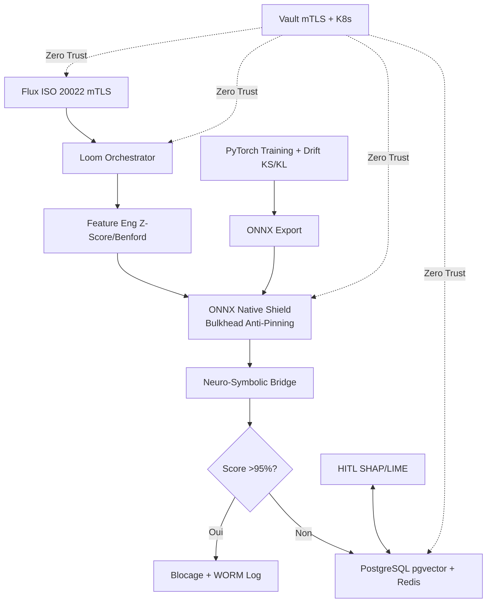

# **Diagramme d'architecture**

```mermaid
graph TD
    A[Flux ISO 20022 mTLS] --> B[Loom Orchestrator]
    B --> C[Feature Eng Z-Score/Benford]
    C --> D[ONNX Native Shield<br/>Bulkhead Anti-Pinning]
    D --> E[Neuro-Symbolic Bridge]
    E --> F{Score >95%?}
    F -->|Oui| G[Blocage + WORM Log]
    F -->|Non| H[PostgreSQL pgvector + Redis]
    I[PyTorch Training + Drift KS/KL] --> J[ONNX Export]
    J --> D
    K[HITL SHAP/LIME] <--> H
    L[Vault mTLS + K8s] -.->|Zero Trust| A & B & D & H
```