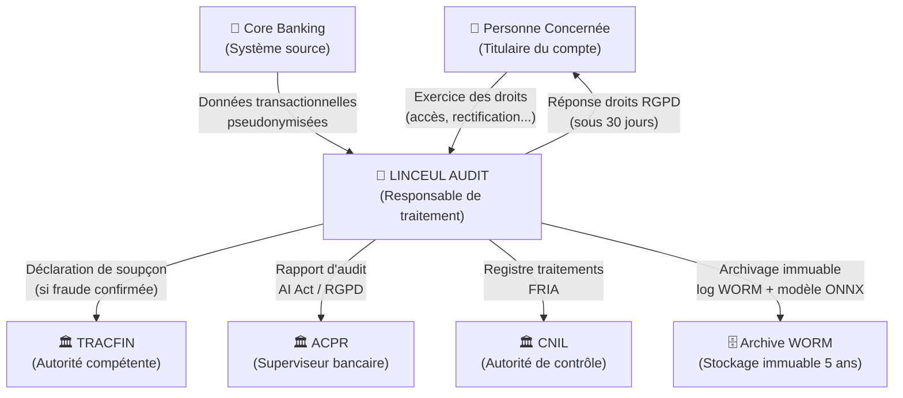
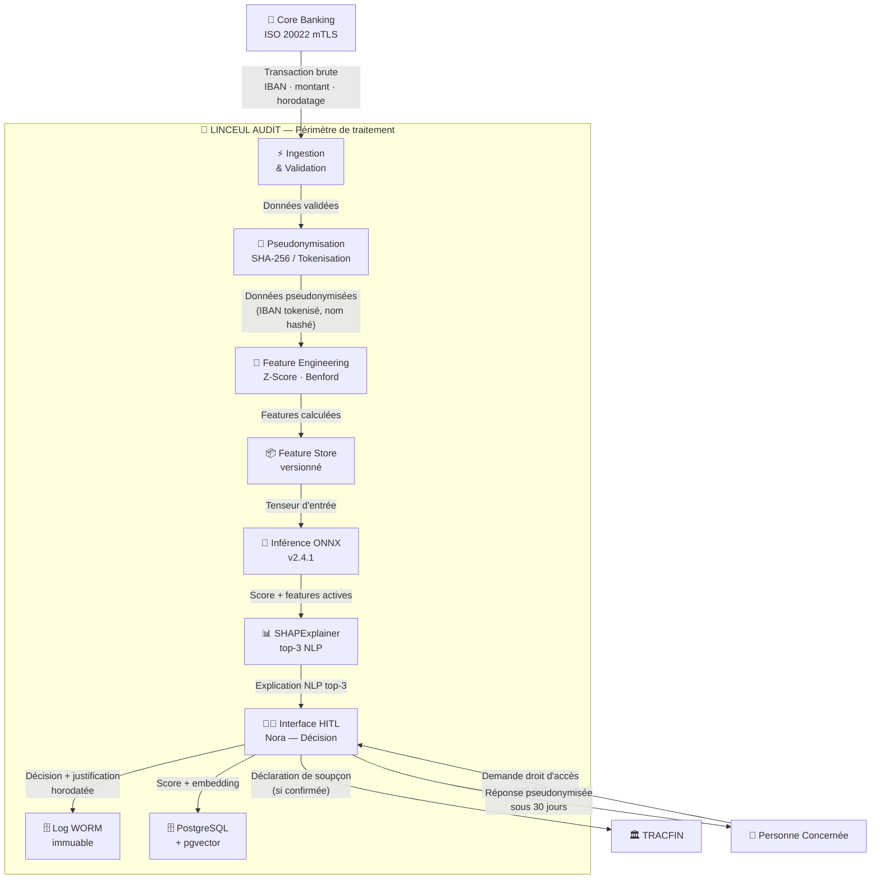
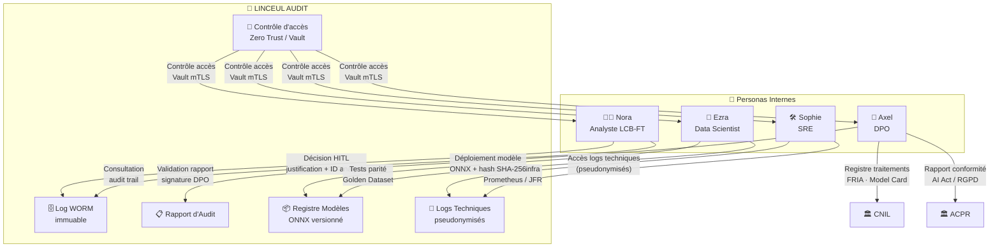
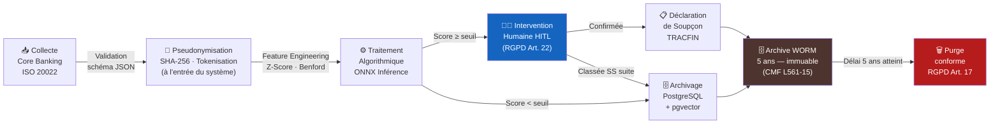
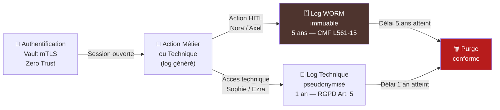

# 🔒 DFD : Flux RGPD des Données Personnelles

___

## Table des Matières

1. [Contexte Juridique & Tensions Réglementaires](#1-contexte-juridique--tensions-réglementaires)
2. [Registre des Données Personnelles](#2-registre-des-données-personnelles)
3. [Niveau 0 — Vue Macro](#3-niveau-0--vue-macro)
4. [Niveau 1 — Flux Transactionnels](#4-niveau-1--flux-transactionnels)
5. [Niveau 1 — Flux Personas Internes](#5-niveau-1--flux-personas-internes)
6. [Niveau 2 — Cycle de Vie RGPD par Catégorie](#6-niveau-2--cycle-de-vie-rgpd-par-catégorie)
7. [Droits RGPD — Cartographie & Contraintes](#7-droits-rgpd--cartographie--contraintes)
8. [Transferts de Données & Destinataires](#8-transferts-de-données--destinataires)
9. [Diagrammes Liés](#9-diagrammes-liés)

___

## 1. Contexte Juridique & Tensions Réglementaires

Linceul Audit opère à l'intersection de deux obligations légales antagonistes :

Obligation | Base légale | Exigence | Impact RGPD
---|---|---|---
**Lutte contre le blanchiment** | CMF Art. L561-15 | Rétention des données **5 ans** minimum | Bloque le droit à l'effacement
**Protection des données** | RGPD Art. 17 | Effacement sur demande de la personne concernée | Limité par L561-15
**Décision automatisée** | RGPD Art. 22 | Droit à intervention humaine (HITL) | Architecture HITL obligatoire
**Transparence algorithmique** | AI Act Annexe III | Explicabilité SHAP opposable | Modèle ONNX + SHAP archivé
**Minimisation** | RGPD Art. 5(1)(c) | Seules les données strictement nécessaires | Features auditées par DPO Axel

> ⚖️ **Principe directeur** : en cas de conflit entre RGPD Art. 17 (effacement) et CMF L561-15 (rétention), la loi spéciale (L561-15) prime sur la loi générale (RGPD), **dans les limites strictes du traitement LCB-FT uniquement**.

___

## 2. Registre des Données Personnelles

### 2.1 Données Transactionnelles

Catégorie | Champ | Pseudonymisé | Rétention | Base légale
---|---|---|---|---
Identité émetteur | Nom, Prénom | ✅ Oui (hash SHA-256) | 5 ans | CMF L561-15
Coordonnées bancaires | IBAN émetteur / bénéficiaire | ✅ Oui (tokenisation) | 5 ans | CMF L561-15
Montant & devise | `amount`, `currency` | ❌ Non | 5 ans | CMF L561-15
Géolocalisation | Pays émetteur / bénéficiaire | ❌ Non | 5 ans | CMF L561-15
Horodatage | `timestamp` | ❌ Non | 5 ans | CMF L561-15
Score de risque | `onnx_score` | ❌ Non | 5 ans | CMF L561-15 + AI Act
Embeddings pgvector | Vecteur 768 dims | ✅ Oui (non réversible) | 5 ans | CMF L561-15

### 2.2 Données Personas Internes

Catégorie | Champ | Pseudonymisé | Rétention | Base légale
---|---|---|---|---
Identité analyste | Nom, ID, rôle (Nora) | ❌ Non (traçabilité juridique) | 5 ans | CMF L561-15
Actions HITL | Décision, justification, horodatage | ❌ Non | 5 ans | CMF L561-15
Accès DPO | Consultations Axel, validations | ❌ Non | 5 ans | CMF L561-15
Logs SRE | Accès technique Sophie | ✅ Oui | 1 an | RGPD Art. 5(1)(e)
Logs Data Scientist | Déploiements Ezra | ✅ Oui | 1 an | RGPD Art. 5(1)(e)

___

## 3. Niveau 0 — Vue Macro

___

## 4. Niveau 1 — Flux Transactionnels

___

## 5. Niveau 1 — Flux Personas Internes

___

## 6. Niveau 2 — Cycle de Vie RGPD par Catégorie

### 6.1 Données Transactionnelles

### 6.2 Données Personas Internes

___

## 7. Droits RGPD — Cartographie & Contraintes

Droit RGPD | Article | Applicable | Contrainte LCB-FT | Procédure
---|---|---|---|---
**Droit d'accès** | Art. 15 | ✅ Oui | Données pseudonymisées uniquement | Requête → Axel (DPO) → réponse < 30 j (US-12)
**Droit de rectification** | Art. 16 | ⚠️ Limité | Impossible sur log WORM immuable | Annotation complémentaire autorisée
**Droit à l'effacement** | Art. 17 | ❌ Bloqué | CMF L561-15 impose 5 ans | Refus motivé par base légale
**Droit à la portabilité** | Art. 20 | ⚠️ Limité | Format machine (JSON) hors données LCB-FT | Export partiel autorisé
**Droit d'opposition** | Art. 21 | ❌ Bloqué | Obligation légale prime sur l'opposition | Refus motivé par CMF L561-15
**Droit à la limitation** | Art. 18 | ⚠️ Limité | Limitation possible hors périmètre LCB-FT | Gel du traitement non-LCB-FT
**Droit intervention humaine** | Art. 22 | ✅ Obligatoire | Architecture HITL imposée | Interface Nora — Override documenté
**Droit à l'explication** | AI Act Art. 27 | ✅ Obligatoire | SHAP top-3 en langage naturel | US-07 — Explicabilité ONNX

📜 Procédure d'exercice des droits RGPD — Détail opérationnel

1. La personne concernée soumet sa demande par écrit (email ou courrier) au DPO Axel.
2. Axel vérifie l'identité du demandeur (pièce d'identité).
3. Axel consulte le registre des traitements et identifie les données concernées.
4. Si les données relèvent du périmètre LCB-FT : réponse motivée de refus ou de limitation sous **30 jours**.
5. Si les données sont hors périmètre LCB-FT : traitement de la demande sous **30 jours** (extensible à 3 mois si complexité justifiée).
6. Toute réponse est archivée dans le log WORM avec horodatage et identité d'Axel.
7. En cas de contestation : saisine de la CNIL possible par la personne concernée.

___

## 8. Transferts de Données & Destinataires

Destinataire | Catégorie | Données transférées | Base légale | Garanties
---|---|---|---|---
**TRACFIN** | Autorité publique FR | Déclaration de soupçon (données pseudonymisées) | CMF L561-15 | Protocole sécurisé TRACFIN
**ACPR** | Autorité de contrôle FR | Rapports d'audit, Model Cards | CMF L511-41 | Canal sécurisé ACPR
**CNIL** | Autorité de contrôle FR | Registre traitements, FRIA | RGPD Art. 30 · AI Act Art. 27 | Canal sécurisé CNIL
**Core Banking** | Système interne | Score de risque (retour) | Contrat de traitement | mTLS interne

> 🌍 **Absence de transfert hors UE** : aucune donnée personnelle n'est transférée vers un pays tiers. Tous les systèmes opèrent dans le périmètre UE. Toute évolution architecturale introduisant un transfert hors UE **doit** faire l'objet d'une analyse d'impact (AIPD) et d'un mécanisme de transfert adéquat (RGPD Art. 46).

___

## 9. Diagrammes Liés

| # | Diagramme | Relation
---|---|---
`#14` 🔗 DFD — Data Lineage (Niveaux 0→2) | Traçabilité technique des features — complément au flux RGPD | Complémentaire
`#22` 🔍 Processus FRIA — AI Act Art. 27 | Évaluation d'impact dont ce DFD est une pièce maîtresse | Dépendant
`#08` 📋 BPMN — Processus LCB-FT | Processus métier encadrant la rétention 5 ans | Contextuel
`#23` 📼 Cycle de vie du Log WORM | Détail du stockage immuable référencé dans ce flux | Technique
`#13` 🗄️ ERD PostgreSQL + pgvector | Schéma de données sous-jacent aux flux niveau 2 | Technique
`#06` 🧑‍⚖️ Séquence — Flux HITL | Implémentation de RGPD Art. 22 matérialisée ici | Technique