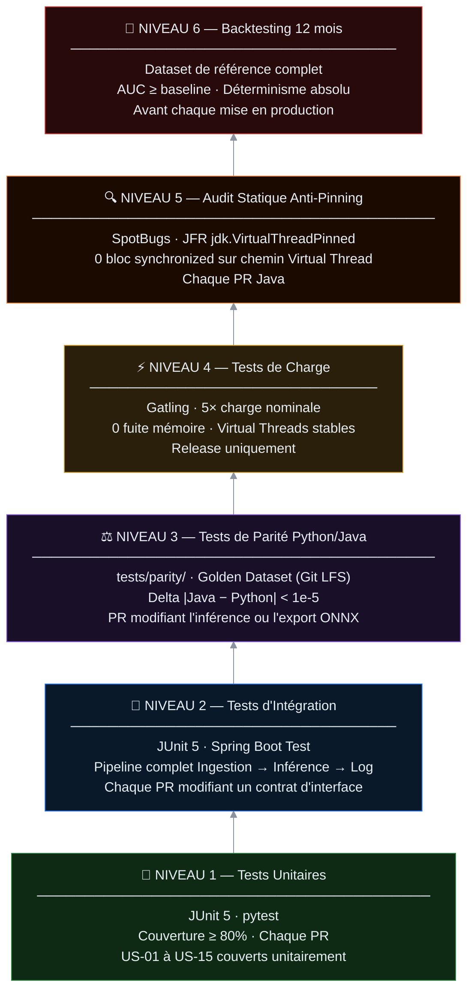

# **Pyramide de Tests**

 
 
 
 
 

</dev>

> Conformément à la **section 8 du CDC**, le plan de tests est draconien et non négociable.  
> La pyramide matérialise les **6 niveaux de validation** obligatoires avant toute mise en production,  
> ordonnés du plus granulaire (base) au plus intégratif (sommet).  
> Aucune régression à un niveau inférieur ne peut être masquée par la réussite d'un niveau supérieur.

___

## Visualisation

___

## Détail des niveaux

### 🟢 Niveau 1 — Tests Unitaires

Attribut | Valeur
---|---
**Frameworks** | JUnit 5 (Java 25) · pytest (Python 3.13)
**Seuil** | Couverture de code ≥ 80% (branches + lignes)
**Déclencheur** | Chaque Pull Request
**User Stories couvertes** | US-01 à US-15
**Commandes** | `./mvnw test` · `pytest tests/unit/`

Les tests unitaires valident chaque composant **en isolation**, avec mocks pour toutes les dépendances externes (BDD, ONNX, KMS). Ils constituent le filet de sécurité de premier niveau et doivent être **les plus rapides** (< 2 min en totalité).

📋 Périmètre par épic

Épic | Composants testés unitairement
---|---
Épic 1 | `JsonSchemaValidator` · `HistoricalEnricher` · `ImputationStrategy`
Épic 2 | `ONNXInferenceService` · `FallbackRuleEngine` · `ParityChecker`
Épic 3 | `SHAPExplainer` · `HITLOverrideService` · `VectorSearchService`
Épic 4 | `WORMLogger` · `PDFReportGenerator` · `RGPDExtractor`
Épic 5 | `ModelEncryptionService` · `AdversarialDetector` · `DriftMonitor`

---

### 🔵 Niveau 2 — Tests d'Intégration

Attribut | Valeur
---|---
**Framework** | JUnit 5 · Spring Boot Test · Testcontainers
**Seuil** | 100% des flux nominaux + cas limites documentés passants
**Déclencheur** | Chaque Pull Request modifiant un contrat d'interface
**Couverture** | Pipeline complet Ingestion → Inférence → Log WORM
**Commandes** | `./mvnw verify -P integration`

Les tests d'intégration valident les **interactions entre composants** avec des infrastructures réelles conteneurisées (PostgreSQL, Redis, ONNX Runtime). Ils détectent les régressions de contrat que les tests unitaires ne peuvent pas voir.

📋 Scénarios d'intégration critiques

Scénario | Composants impliqués | Critère
---|---|---
Flux nominal complet | Ingestion → Inférence → SHAP → WORM | Transaction traitée end-to-end < 5 ms
Fallback heuristique | InferencePool → FallbackRuleEngine | Bascule en < 500 ms
Override HITL | UI → HITLService → WORMLogger | Log immuable généré
Similarité pgvector | VectorSearchService → PostgreSQL | Résultat en < 200 ms

---

### 🟣 Niveau 3 — Tests de Parité Python / Java

Attribut | Valeur
---|---
**Framework** | `tests/parity/` (pytest + JUnit 5)
**Dataset** | Golden Dataset — `tests/fixtures/golden_dataset/` (Git LFS)
**Seuil** | Delta \|score Java − score Python\| < **1e-5** sur 100% des cas
**Déclencheur** | Toute PR modifiant l'inférence ONNX ou l'export du modèle
**Commandes** | `pytest tests/parity/ -v` + `./mvnw test -Parity`

Ce niveau est **le verrou critique de l'architecture hybride**. Il garantit que le modèle entraîné en Python produit exactement le même score une fois chargé par ONNX Runtime en Java. Toute divergence constitue une régression bloquante — le Golden Dataset est immuable et versionné (CDC §4.1).

---

### 🟡 Niveau 4 — Tests de Charge

Attribut | Valeur
---|---
**Framework** | Gatling
**Seuil** | 5× charge nominale · 0 fuite mémoire · Latence inférence < 1 ms P99
**Déclencheur** | Branche `release/vX.Y.Z` uniquement
**Durée** | Minimum 30 minutes de charge soutenue
**Commandes** | `./mvnw gatling:test`

Les tests de charge valident le comportement des **Virtual Threads sous pression** et l'efficacité du Pattern Bulkhead. L'absence de fuite mémoire est vérifiée via JFR avec analyse post-run. Tout résultat hors seuil bloque la release.

📋 Scénarios de charge

Scénario | Charge | Seuil | Metric
---|---|---|---
Nominal | 1× | Latence < 1 ms P99 | JFR · Prometheus
Pic | 5× | 0 timeout · 0 OOM | Gatling report
Dégradation | 10× | Backpressure actif · 0 crash | Load Shedding log
Récupération | Retour nominal | Latence revenue < 1 ms en < 30 s | Grafana

---

### 🟠 Niveau 5 — Audit Statique Anti-Pinning

Attribut | Valeur
---|---
**Outils** | SpotBugs · CheckStyle · JFR `jdk.VirtualThreadPinned`
**Seuil** | **0 violation** — tout bloc `synchronized` sur un chemin Virtual Thread = bloquant
**Déclencheur** | Chaque PR Java
**Commandes** | `./mvnw spotbugs:check` · analyse JFR post-test de charge

L'audit statique détecte en amont les constructions Java susceptibles de provoquer le **Pinning** des Virtual Threads (CDC §3.2). Il est complémentaire du Niveau 4 : le statique détecte les risques structurels, le JFR les manifestations runtime.

---

### 🔴 Niveau 6 — Backtesting 12 mois

Attribut | Valeur
---|---
**Dataset** | 12 derniers mois de transactions (stockage externe DVC)
**Seuil** | AUC ≥ baseline établie · Déterminisme absolu (rejeu identique)
**Déclencheur** | Avant chaque mise en production sur `master`
**Durée** | Variable selon volume — prévoir 2 à 4 heures
**Validation** | Direction Technique + Direction Data + Direction Conformité

Le backtesting est l'**ultime validation juridique** avant production. Il prouve que le nouveau modèle aurait détecté les fraudes connues des 12 derniers mois et constitue la pièce maîtresse du dossier ACPR. Le déterminisme absolu exigé par CMF L561-15 est vérifié ici : même input + même modèle = même output, garanti.

---

## Matrice déclencheurs × niveaux

Événement | N1 Unit | N2 Intégration | N3 Parité | N4 Charge | N5 Statique | N6 Backtest 
---|:-:|:-:|:-:|:-:|:-:|:-:
Pull Request (tout type) | ✅ | — | — | — | — | —
PR modifiant un contrat d'interface | ✅ | ✅ | — | — | — | —
PR modifiant l'inférence / ONNX | ✅ | ✅ | ✅ | — | — | —
PR Java (tout composant) | ✅ | — | — | — | ✅ | —
Création branche `release/*` | ✅ | ✅ | ✅ | ✅ | ✅ | —
Avant merge sur `master` | ✅ | ✅ | ✅ | ✅ | ✅ | ✅

___

[← Diagrammes](../) · [Matrice Traçabilité](../traceabilityMatrix/) · [Documentation](../../)

___
© 2026 - Projet Linceul Audit. Tous droits réservés.

