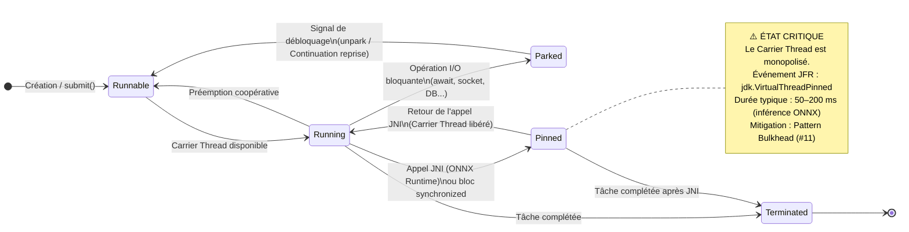

# 🧵 État : Virtual Thread & Pinning JNI<a href="../"></a>
<div align="center">

 
 
 

<!--  -->

</div><hr>

## Table des Matières

1. [Contexte & Motivation](#1-contexte--motivation)
2. [Modélisation — Automate d'États](#2-modélisation--automate-détats)
3. [Description des États](#3-description-des-états)
4. [Description des Transitions](#4-description-des-transitions)
5. [Événement JFR `jdk.VirtualThreadPinned`](#5-événement-jfr-jdkvirtualthreadpinned)
6. [Stratégie Bulkhead — Mitigation](#6-stratégie-bulkhead--mitigation)
7. [Règles d'Architecture](#7-règles-darchitecture)
8. [Diagrammes Liés](#8-diagrammes-liés)

---

## 1. Contexte & Motivation

Linceul Audit exploite **Project Loom** (Java 21) pour sa couche d'ingestion HTTP :
chaque requête ISO 20022 entrante est traitée dans un **Virtual Thread** (VT), permettant une concurrence structurée à coût mémoire quasi nul (~2 Ko/VT vs ~1 Mo/Platform Thread).

### Le Problème du Pinning JNI

Le moteur d'inférence **ONNX Runtime** est une bibliothèque native (C++) invoquée via **JNI**.
Lorsqu'un Virtual Thread entre dans un bloc `synchronized` ou exécute un appel JNI, il est **épinglé (Pinned)** à son Carrier Thread (Platform Thread) :
il **ne peut plus être démonté** de ce thread système, annulant intégralement le bénéfice de la légèreté de Loom.

> ⚠️ **Régression critique** : un seul Virtual Thread épinglé pendant l'inférence ONNX (typiquement 50–200 ms) bloque son Carrier Thread pour toute cette durée, dégradant le débit global du pool.

### Conséquences architecturales

* L'inférence ONNX **ne doit jamais** être invoquée depuis un Virtual Thread directement.
* Le **Pattern Bulkhead** (`#11`) isole les appels JNI dans un `ThreadPoolExecutor` dédié de Platform Threads.
* L'événement JFR `jdk.VirtualThreadPinned` est la sonde de détection de toute régression.

---

## 2. Modélisation — Automate d'États



---

## 3. Description des États

État | Description | Carrier Thread | Risque
---|---|---|---
**`Runnable`** | VT prêt à s'exécuter, en attente d'un Carrier Thread libre | Non attaché | —
**`Running`** | VT en cours d'exécution sur un Carrier Thread | Attaché (démontable) | —
**`Parked`** | VT suspendu sur une opération I/O ; le Carrier Thread est **libéré** et peut prendre un autre VT | **Libéré** ✅ | —
**`Pinned`** | VT épinglé suite à un appel JNI ou un `synchronized` ; le Carrier Thread est **monopolisé** | **Monopolisé** ❌ | **CRITIQUE**
**`Terminated`** | VT terminé, ressources libérées | Libéré | —

---

## 4. Description des Transitions

Transition | Déclencheur | Comportement JVM
---|---|---
`[*] → Runnable` | `Thread.ofVirtual().start()` ou `submit()` | Création d'une Continuation légère
`Runnable → Running` | Carrier Thread libre dans le ForkJoinPool | Montage de la Continuation sur le Platform Thread
`Running → Parked` | `LockSupport.park()`, I/O non-bloquante (NIO), `await()` | **Démontage** de la Continuation → Carrier Thread libéré pour un autre VT
`Parked → Runnable` | `LockSupport.unpark()`, signal I/O, timeout | Continuation reprogrammée dans le ForkJoinPool
`Running → Pinned` | Entrée dans un bloc `synchronized` **ou** appel JNI (`OrtEnvironment`, `OrtSession`) | **Épinglage** — aucun démontage possible — Carrier Thread bloqué
`Pinned → Running` | Sortie du bloc `synchronized` ou retour de l'appel JNI | Désépinglage — Carrier Thread à nouveau disponible
`Running / Pinned → Terminated` | Fin normale ou exception de la tâche | Continuation détruite, GC éligible

---

## 5. Événement JFR `jdk.VirtualThreadPinned`

La JVM Java 21 émet automatiquement l'événement **`jdk.VirtualThreadPinned`** lorsqu'un Virtual Thread reste épinglé au-delà d'un seuil configurable.

### Configuration JFR (`jfr-profile.jfc`)

```xml
<event name="jdk.VirtualThreadPinned">
    <!-- Seuil d'alerte : 20ms — toute inférence ONNX dépassant ce seuil est tracée -->
    <setting name="threshold">20 ms</setting>
    <setting name="enabled">true</setting>
    <setting name="stackTrace">true</setting>
</event>
```

### Activation JVM au démarrage

```bash
# Mode surveillance continu — détection des épinglages critiques
java \
  -Djdk.tracePinnedThreads=full \
  -XX:StartFlightRecording=filename=linceul-pinning.jfr,settings=jfr-profile.jfc \
  -jar linceul-audit.jar
```

### Champs de l'événement capturé

| Champ | Type | Description |
|-------|------|-------------|
| `startTime` | `Timestamp` | Instant d'entrée en état Pinned |
| `duration` | `Duration` | Durée totale de l'épinglage |
| `carrierThread` | `Thread` | Platform Thread monopolisé |
| `stackTrace` | `StackTrace` | Pile d'appels — identifie l'appel JNI incriminé |

<details>
<summary>🔍 Exemple de stack trace JFR typique lors d'un Pinning ONNX</summary>

```
jdk.VirtualThreadPinned
  duration = 147.3 ms  ← inférence ONNX
  carrierThread = "ForkJoinPool-1-worker-3"
  stackTrace:
    ai.onnxruntime.OrtSession.run(OrtSession.java:...)  ← appel JNI
    com.linceul.inference.ONNXInferenceService.infer(...)
    com.linceul.handler.TransactionHandler.handle(...)
    java.lang.VirtualThread.run(VirtualThread.java:...)
```

> ⚠️ Ce stack trace indique une **violation architecturale P0** : `ONNXInferenceService.infer()` est invoqué depuis un Virtual Thread.
> La correction consiste à déléguer cet appel au `BulkheadExecutor` (Platform Threads dédiés — voir `#11`).

</details>

---

## 6. Stratégie Bulkhead — Mitigation

Le **Pattern Bulkhead** (`#11`) est la **seule mitigation architecturale validée** contre le Pinning JNI.

```
┌────────────────────────────────────────────────────────────────┐
│  Zone I/O — ForkJoinPool (Virtual Threads)                     │
│  HTTP Handler, validation JSON, enrichissement DB, logs WORM   │
│  → Parked/Runnable librement ; aucun JNI                       │
└───────────────────────────┬────────────────────────────────────┘
                            │  CompletableFuture.supplyAsync()
                            │  soumission non-bloquante
                            ▼
┌────────────────────────────────────────────────────────────────┐
│  Zone CPU/JNI — ThreadPoolExecutor (Platform Threads dédiés)   │
│  BulkheadExecutor : coreSize = Runtime.availableProcessors()   │
│  → Seul endroit où OrtSession.run() est autorisé               │
│  → Épinglage inévitable mais ISOLÉ et PRÉVISIBLE               │
└────────────────────────────────────────────────────────────────┘
```

> 🔒 **Règle d'architecture** : `OrtSession.run()` et tout appel JNI ONNX **DOIVENT** être encapsulés dans un `Callable` soumis au `BulkheadExecutor`. Toute invocation directe depuis un Virtual Thread est une **régression de sévérité P0**, détectable via l'audit statique du pipeline CI/CD (`#17`).

---

## 7. Règles d'Architecture

ID Règle | Énoncé | Criticité
---|---|---
**ARCH-JVM-01** | `OrtSession.run()` est exclusivement appelé depuis `BulkheadExecutor` (Platform Threads) | 🔴 P0 — Bloquant
**ARCH-JVM-02** | Aucun bloc `synchronized` ne doit envelopper un appel réseau ou I/O dans la couche Virtual Thread | 🔴 P0 — Bloquant
**ARCH-JVM-03** | Le seuil JFR `jdk.VirtualThreadPinned` est fixé à **20 ms** en production | 🟠 P1 — Majeur
**ARCH-JVM-04** | Toute alerte JFR Pinning > 20 ms déclenche une notification Prometheus (`linceul_vthread_pinned_total`) | 🟠 P1 — Majeur
**ARCH-JVM-05** | La revue statique du bytecode (`ARCH-JVM-01` et `ARCH-JVM-02`) est intégrée dans le pipeline CI/CD (`#17`) | 🟡 P2 — Mineur

---

## 8. Diagrammes Liés

|# | Diagramme | Relation
---|---|---
`#11` 🏗️ Séquence — Pattern Bulkhead | Mitigation directe du Pinning JNI — séparation VT / Platform Threads | Complémentaire
`#12` 📉 Backpressure / Load Shedding | Conséquence du dimensionnement du BulkheadExecutor sur la file d'attente | Dépendant
`#29` 🔁 Automate d'États — Résilience Système | États macro du système en réponse à la saturation du Bulkhead | Dépendant
`#09` 🔬 Activité — Cycle de vie modèle ONNX | Origine des artefacts `.onnx` chargés dans `OrtSession` | Contextuel
`#30` 🧪 Pyramide de Tests | Test d'audit statique détectant les appels JNI hors Bulkhead | Qualité
