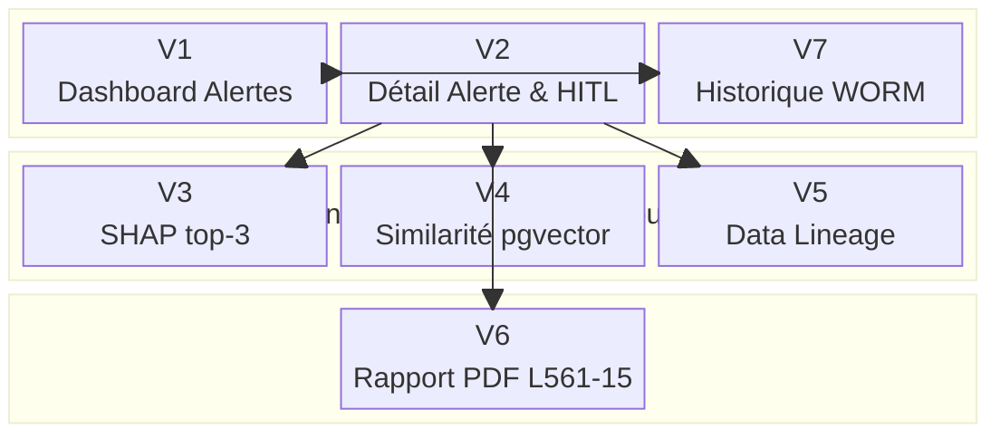

# 🖥️ `#27` — Wireframe : Interface Analyste (Nora)

<a href="../"></a>


---

## Table des Matières

1. [Contraintes UX & Exigences](#1-contraintes-ux--exigences)
2. [Architecture de Navigation](#2-architecture-de-navigation)
3. [V1 — Dashboard Alertes](#3-v1--dashboard-alertes)
4. [V2 — Détail Alerte & HITL](#4-v2--détail-alerte--hitl)
5. [V3 — Panneau SHAP top-3](#5-v3--panneau-shap-top-3)
6. [V4 — Similarité pgvector](#6-v4--similarité-pgvector)
7. [V5 — Data Lineage Contextuel](#7-v5--data-lineage-contextuel)
8. [V6 — Prévisualisation Rapport PDF L561-15](#8-v6--prévisualisation-rapport-pdf-l561-15)
9. [V7 — Historique WORM](#9-v7--historique-worm)
10. [États Contextuels de l'Interface](#10-états-contextuels-de-linterface)
11. [Diagrammes Liés](#11-diagrammes-liés)

---

## 1. Contraintes UX & Exigences

| Contrainte | Valeur | Source |
|------------|--------|--------|
| Latence d'affichage maximale | < 200 ms | US-01 |
| SHAP top-3 | En langage naturel (non technique) | US-07 |
| Bouton Override | Justification textuelle obligatoire | US-08 |
| Lien Data Lineage | Contextuel à la feature sélectionnée | `#14` |
| Génération rapport PDF | Déclenchée automatiquement après validation | US-11 |
| Log WORM | Toute action de Nora est tracée de manière immuable | US-10 |
| Accessibilité | Contraste WCAG AA minimum | — |
| Responsive | Desktop 1440 px prioritaire | — |

---

## 2. Architecture de Navigation



---

## 3. V1 — Dashboard Alertes

### État nominal

```
┌─────────────────────────────────────────────────────────────────────────────┐
│ 🔴 LINCEUL AUDIT                          Nora — Analyste LCB-FT   [↩ Déco] │
├─────────────────────────────────────────────────────────────────────────────┤
│  Alertes en attente (12)          [🔍 Recherche...]    [Filtres ▼]  [↺ Tri] │
├──────┬──────────────┬───────────┬──────────┬───────────┬────────────────────┤
│ Prio │ ID Alerte    │ Score     │ Montant  │ Horodatage│ Statut             │
├──────┼──────────────┼───────────┼──────────┼───────────┼────────────────────┤
│  🔴  │ TXN-20240310 │ 0.97      │ 48 200 € │ 19:04:12  │ ⏳ En attente      │
│  🔴  │ TXN-20240309 │ 0.94      │ 12 750 € │ 18:51:03  │ ⏳ En attente      │
│  🟠  │ TXN-20240308 │ 0.81      │  3 400 € │ 17:22:44  │ ⏳ En attente      │
│  🟠  │ TXN-20240307 │ 0.78      │  9 100 € │ 16:10:09  │ 🕐 Timeout < 30mn │
│  🟡  │ TXN-20240306 │ 0.65      │  1 200 € │ 15:03:55  │ ⏳ En attente      │
│  ...  │ ...          │ ...       │ ...      │ ...       │ ...                │
├──────┴──────────────┴───────────┴──────────┴───────────┴────────────────────┤
│  [← Préc.]                                                    [Suiv. →]  1/3 │
└─────────────────────────────────────────────────────────────────────────────┘
```

### État — File vide

```
┌─────────────────────────────────────────────────────────────────────────────┐
│ 🔴 LINCEUL AUDIT                          Nora — Analyste LCB-FT   [↩ Déco] │
├─────────────────────────────────────────────────────────────────────────────┤
│                                                                             │
│                     ✅ Aucune alerte en attente                             │
│               Toutes les alertes ont été traitées.                          │
│                                                                             │
└─────────────────────────────────────────────────────────────────────────────┘
```

### État — Chargement (< 200 ms)

```
┌─────────────────────────────────────────────────────────────────────────────┐
│ 🔴 LINCEUL AUDIT                          Nora — Analyste LCB-FT   [↩ Déco] │
├─────────────────────────────────────────────────────────────────────────────┤
│                                                                             │
│                        ⏳ Chargement des alertes...                         │
│                    [████████████░░░░░░░░░░░░]  62%                          │
│                                                                             │
└─────────────────────────────────────────────────────────────────────────────┘
```

---

## 4. V2 — Détail Alerte & HITL

### État nominal — Analyse en cours

```
┌─────────────────────────────────────────────────────────────────────────────┐
│ ← Retour     🔴 Alerte TXN-20240310                         ⏱ 00:47:12 restant │
├───────────────────────────┬─────────────────────────────────────────────────┤
│  CONTEXTE TRANSACTION     │  DÉCISION HITL                                  │
│  ─────────────────────    │  ──────────────────────────────────────────     │
│  ID        TXN-20240310   │  Score ONNX      ████████████████░░  0.97       │
│  Montant   48 200,00 €    │  Seuil décision  0.75                           │
│  Devise    EUR            │  Résultat        🔴 FRAUDE PROBABLE              │
│  Émetteur  IBAN FR76...   │                                                  │
│  Bénéfic.  IBAN DE89...   │  [ 📊 Voir SHAP top-3         → ]               │
│  Pays      DE / FR        │  [ 🔍 Transactions similaires → ]               │
│  Horodatage 19:04:12      │  [ 🔗 Data Lineage            → ]               │
│  Réseau    SWIFT          │                                                  │
├───────────────────────────┴─────────────────────────────────────────────────┤
│  DÉCISION ANALYSTE                                                          │
│  ─────────────────────────────────────────────────────────────────────────  │
│  Justification (obligatoire) :                                              │
│  ┌─────────────────────────────────────────────────────────────────────┐   │
│  │ [Saisir la justification...]                                        │   │
│  │                                                                     │   │
│  └─────────────────────────────────────────────────────────────────────┘   │
│                                                                             │
│  [✅ Confirmer la suspicion]   [📤 Escalader vers DPO]   [🗂 Classer sans suite] │
└─────────────────────────────────────────────────────────────────────────────┘
```

### État — Override soumis (confirmation)

```
┌─────────────────────────────────────────────────────────────────────────────┐
│ ← Retour     🔴 Alerte TXN-20240310                              ✅ Traitée │
├─────────────────────────────────────────────────────────────────────────────┤
│                                                                             │
│   ✅ Décision enregistrée : SUSPICION CONFIRMÉE                             │
│   Horodatage WORM  :  2024-03-10T19:52:07Z                                 │
│   Analyste         :  Nora — ID#4821                                        │
│   Rapport PDF      :  ⏳ Génération en cours...  [████████░░░░]  67%        │
│                                                                             │
│   [ 📄 Voir le rapport ]        [ ← Retour aux alertes ]                   │
│                                                                             │
└─────────────────────────────────────────────────────────────────────────────┘
```

### État — Timeout imminent (< 5 min)

```
┌─────────────────────────────────────────────────────────────────────────────┐
│ ← Retour     🔴 Alerte TXN-20240307              ⚠️ TIMEOUT DANS 00:04:33  │
├─────────────────────────────────────────────────────────────────────────────┤
│                                                                             │
│  ⚠️  Cette alerte sera automatiquement escaladée dans 4 minutes 33 secondes │
│       si aucune décision n'est prise.                                       │
│                                                                             │
│  [✅ Confirmer la suspicion]   [📤 Escalader vers DPO]   [🗂 Classer sans suite] │
│                                                                             │
└─────────────────────────────────────────────────────────────────────────────┘
```

### État — Escaladée vers DPO

```
┌─────────────────────────────────────────────────────────────────────────────┐
│ ← Retour     🟡 Alerte TXN-20240308                    📤 En attente DPO   │
├─────────────────────────────────────────────────────────────────────────────┤
│                                                                             │
│   📤 Alerte escaladée vers Axel (DPO) — 2024-03-10T18:03:22Z               │
│   Motif saisi  :  « Personne politiquement exposée — arbitrage requis »     │
│   Statut DPO   :  ⏳ En attente de décision                                 │
│                                                                             │
│   [ 🔔 Me notifier à la décision d'Axel ]    [ ← Retour aux alertes ]      │
│                                                                             │
└─────────────────────────────────────────────────────────────────────────────┘
```

---

## 5. V3 — Panneau SHAP top-3

```
┌─────────────────────────────────────────────────────────────────────────────┐
│ ✕  SHAP — Explication de la décision          Alerte TXN-20240310           │
├─────────────────────────────────────────────────────────────────────────────┤
│                                                                             │
│  🔴 Score de risque : 0.97 — FRAUDE PROBABLE                                │
│                                                                             │
│  Les 3 facteurs ayant le plus contribué à cette décision :                  │
│                                                                             │
│  1️⃣  Le montant moyen des 7 derniers jours (avg_amount_7d)                  │
│      est 12× supérieur à la normale pour ce profil client.                  │
│      Contribution : ████████████████████░░░░  +0.41                         │
│                                                                             │
│  2️⃣  La transaction implique un pays à risque élevé (country_risk_score)   │
│      classé en zone GAFI non-coopérative.                                   │
│      Contribution : ████████████░░░░░░░░░░░░  +0.29                         │
│                                                                             │
│  3️⃣  La vélocité horaire (tx_velocity_1h) est anormalement élevée :         │
│      8 transactions en 47 minutes contre une moyenne de 1,2.               │
│      Contribution : ████████░░░░░░░░░░░░░░░░  +0.18                         │
│                                                                             │
│  [ 🔗 Voir Data Lineage de avg_amount_7d ]                                  │
│                                                                             │
│  ℹ️  Explication générée par SHAP (SHapley Additive exPlanations)           │
│      Modèle ONNX v2.4.1 — Chargé le 2024-03-10T06:00:00Z                   │
│                                                                             │
└─────────────────────────────────────────────────────────────────────────────┘
```

---

## 6. V4 — Similarité pgvector

```
┌─────────────────────────────────────────────────────────────────────────────┐
│ ✕  Transactions similaires (pgvector)         Alerte TXN-20240310           │
├─────────────────────────────────────────────────────────────────────────────┤
│                                                                             │
│  Distance cosinus ≤ 0.05 — Top 5 transactions les plus proches :            │
│                                                                             │
│  ┌──────────────┬───────────┬──────────┬───────────┬──────────────────────┐ │
│  │ ID           │ Similarité│ Montant  │ Date      │ Décision passée      │ │
│  ├──────────────┼───────────┼──────────┼───────────┼──────────────────────┤ │
│  │ TXN-20240201 │ 99.2%    │ 51 000 € │ 2024-02-01│ 🔴 Fraude confirmée  │ │
│  │ TXN-20240115 │ 98.7%    │ 46 800 € │ 2024-01-15│ 🔴 Fraude confirmée  │ │
│  │ TXN-20231204 │ 97.1%    │ 49 300 € │ 2023-12-04│ 🔴 Fraude confirmée  │ │
│  │ TXN-20231118 │ 95.4%    │ 44 100 € │ 2023-11-18│ 🟡 Classée ss suite  │ │
│  │ TXN-20231005 │ 94.8%    │ 52 700 € │ 2023-10-05│ 🔴 Fraude confirmée  │ │
│  └──────────────┴───────────┴──────────┴───────────┴──────────────────────┘ │
│                                                                             │
│  📊 4/5 transactions similaires ont été confirmées comme fraudes.           │
│                                                                             │
│  [ Voir le détail de TXN-20240201 ]                                         │
│                                                                             │
└─────────────────────────────────────────────────────────────────────────────┘
```

### État — Résultats dégradés

```
┌─────────────────────────────────────────────────────────────────────────────┐
│ ✕  Transactions similaires (pgvector)         Alerte TXN-20240310           │
├─────────────────────────────────────────────────────────────────────────────┤
│                                                                             │
│  ⚠️  Aucune transaction suffisamment similaire trouvée (distance > 0.15).   │
│      Profil transactionnel atypique — analyse manuelle recommandée.         │
│                                                                             │
└─────────────────────────────────────────────────────────────────────────────┘
```

---

## 7. V5 — Data Lineage Contextuel

```
┌─────────────────────────────────────────────────────────────────────────────┐
│ ✕  Data Lineage — avg_amount_7d               Alerte TXN-20240310           │
├─────────────────────────────────────────────────────────────────────────────┤
│                                                                             │
│  Feature sélectionnée : avg_amount_7d  (v3.2.1)                             │
│  Valeur calculée      : 48 200,00 €                                         │
│  Stratégie imputation : médiane  (aucune valeur NaN détectée)               │
│                                                                             │
│  Chaîne de provenance :                                                     │
│                                                                             │
│  [ Core Banking ISO 20022 ]                                                 │
│          │  Extraction brute — champ <Amt>                                  │
│          ▼                                                                  │
│  [ ETL — Normalisation Z-Score ]                                            │
│          │  Fenêtre glissante 7j — agrégation SUM / COUNT                   │
│          ▼                                                                  │
│  [ Feature Store v3.2.1 ]                                                   │
│          │  Clé : customer_id#8821 — partition 2024-W10                     │
│          ▼                                                                  │
│  [ Tenseur d'entrée ONNX — index  ]                                   │
│          │  Valeur injectée : 48200.00                                      │
│          ▼                                                                  │
│  [ OrtSession.run() — Modèle v2.4.1 ]                                       │
│                                                                             │
│  ✅ Traçabilité complète — reproductibilité garantie (Art. L561-15 CMF)     │
│                                                                             │
└─────────────────────────────────────────────────────────────────────────────┘
```

---

## 8. V6 — Prévisualisation Rapport PDF L561-15

### État — Génération en cours

```
┌─────────────────────────────────────────────────────────────────────────────┐
│ ✕  Rapport PDF L561-15                        Alerte TXN-20240310           │
├─────────────────────────────────────────────────────────────────────────────┤
│                                                                             │
│                     ⏳ Génération du rapport en cours...                    │
│                     [████████████████░░░░░░░░]  67%                         │
│                     Estimation : ~2 secondes                                │
│                                                                             │
└─────────────────────────────────────────────────────────────────────────────┘
```

### État — Rapport prêt

```
┌─────────────────────────────────────────────────────────────────────────────┐
│ ✕  Rapport PDF L561-15                        Alerte TXN-20240310           │
├─────────────────────────────────────────────────────────────────────────────┤
│                                                                             │
│  ┌─────────────────────────────────────────────────────────────────────┐   │
│  │                    DÉCLARATION DE SOUPÇON                           │   │
│  │               Art. L561-15 Code Monétaire et Financier              │   │
│  │  ─────────────────────────────────────────────────────────────────  │   │
│  │  Établissement   : [Nom Banque]                                     │   │
│  │  Référence       : DS-2024-03-10-TXN20240310                        │   │
│  │  Date            : 10/03/2024 — 19:52:07 UTC                        │   │
│  │  Analyste        : Nora — ID#4821                                   │   │
│  │  ─────────────────────────────────────────────────────────────────  │   │
│  │  Transaction     : TXN-20240310                                     │   │
│  │  Montant         : 48 200,00 EUR                                    │   │
│  │  Score ONNX      : 0.97 (seuil : 0.75)                              │   │
│  │  Justification   : « [Texte saisi par Nora] »                       │   │
│  │  ─────────────────────────────────────────────────────────────────  │   │
│  │  Modèle ONNX     : v2.4.1 — Hash SHA-256 : a3f9...                  │   │
│  │  Log WORM        : WORM-20240310-195207-4821                        │   │
│  │  [Page 1/3 ▼]                                                       │   │
│  └─────────────────────────────────────────────────────────────────────┘   │
│                                                                             │
│  [ 📥 Télécharger le PDF ]    [ 📤 Envoyer au DPO Axel ]    [ ✕ Fermer ]   │
│                                                                             │
└─────────────────────────────────────────────────────────────────────────────┘
```

---

## 9. V7 — Historique WORM

```
┌─────────────────────────────────────────────────────────────────────────────┐
│ ← Retour     📜 Historique WORM — Nora (ID#4821)                            │
├─────────────────────────────────────────────────────────────────────────────┤
│  [🔍 Recherche par ID alerte ou date...]              [Exporter CSV ↓]      │
├──────────────────────┬──────────────┬─────────────────┬─────────────────────┤
│ Horodatage WORM      │ ID Alerte    │ Action          │ Hash SHA-256        │
├──────────────────────┼──────────────┼─────────────────┼─────────────────────┤
│ 2024-03-10T19:52:07Z │ TXN-20240310 │ ✅ Confirmée    │ a3f9c2...           │
│ 2024-03-10T18:03:22Z │ TXN-20240308 │ 📤 Escaladée   │ b71e44...           │
│ 2024-03-09T14:21:55Z │ TXN-20240305 │ 🗂 Sans suite  │ c882d1...           │
│ 2024-03-08T11:07:33Z │ TXN-20240301 │ ✅ Confirmée    │ d019f3...           │
│ ...                  │ ...          │ ...             │ ...                 │
├──────────────────────┴──────────────┴─────────────────┴─────────────────────┤
│  ℹ️  Entrées immuables — aucune modification possible (Art. L561-15 CMF)    │
│  [ ← Préc. ]                                                  [ Suiv. → ]  │
└─────────────────────────────────────────────────────────────────────────────┘
```

---

## 10. États Contextuels de l'Interface

| Vue | État | Déclencheur | Comportement UI |
|-----|------|-------------|-----------------|
| V1 | Nominal | Alertes présentes | Liste triée par score décroissant |
| V1 | Vide | Toutes alertes traitées | Message de confirmation ✅ |
| V1 | Chargement | Requête en cours | Barre de progression < 200 ms |
| V1 | Timeout imminent | Délai < 30 min | Badge orange ⏱ sur la ligne |
| V2 | Analyse en cours | Alerte ouverte | Formulaire HITL actif |
| V2 | Override soumis | Décision validée | Confirmation + progression PDF |
| V2 | Timeout imminent | Délai < 5 min | Bandeau rouge ⚠️ + compte à rebours |
| V2 | Timeout atteint | Délai = 0 | Formulaire verrouillé — escalade auto |
| V2 | Escaladée DPO | Escalade soumise | Statut + option notification retour |
| V3 | Nominal | SHAP disponible | Top-3 en langage naturel + barres |
| V3 | Indisponible | Erreur SHAPExplainer | Message d'erreur + log forensique |
| V4 | Nominal | Similarités trouvées | Tableau top-5 avec décisions passées |
| V4 | Dégradé | Distance > 0.15 | Avertissement — analyse manuelle |
| V5 | Nominal | Feature sélectionnée | Chaîne de provenance complète |
| V5 | Incomplet | Lineage partiel | Avertissement traçabilité partielle |
| V6 | Génération | Rapport déclenché | Barre de progression ~2 s |
| V6 | Prêt | Génération terminée | Prévisualisation + boutons d'action |
| V6 | Erreur | Échec génération | Message d'erreur + retry |
| V7 | Nominal | Historique chargé | Liste paginée immuable |
| V7 | Vide | Aucune action | Message « Aucune entrée » |

---

## 11. Diagrammes Liés

| # | Diagramme | Relation |
|---|-----------|----------|
| `#26` 🗺️ User Journey — Nora | Parcours cognitif dont ce wireframe est la matérialisation UI | Complémentaire |
| `#06` 🧑‍⚖️ Séquence — Flux HITL | Logique technique derrière les boutons Override de V2 | Technique |
| `#07` 🔄 Séquence — Fallback heuristique | État dégradé visible dans V2 si ONNX indisponible | Technique |
| `#13` 🗄️ ERD PostgreSQL + pgvector | Données alimentant V4 (similarité) et V7 (WORM) | Données |
| `#14` 🔗 DFD — Data Lineage | Contenu détaillé de V5 | Données |
| `#25` 👤 Use Cases UML — par Persona | Cas d'utilisation formels associés à chaque vue | Contextuel |
