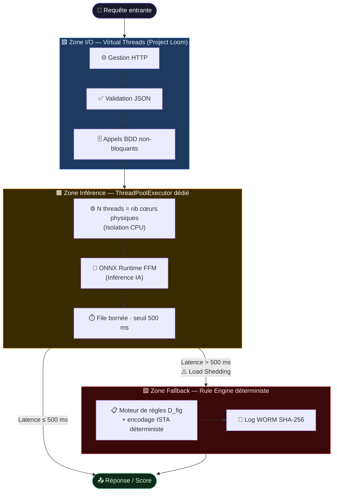

# LINCEUL-AUDIT — Cahier des Charges Technique et Fonctionnel<a href="../"></a>

> **Plateforme Hybride de Détection de Fraude Financière**

---

<div align="center">

Champ | Valeur
---|---
**Code Projet** | `LINCEUL-2026`
**Version** | `2.0 — Mars 2026`
**Classification** | ⚠️ CONFIDENTIEL / HAUTE CRITICITÉ
**Architecture** | Java 25 (Loom + Panama) · Python 3.13 · ONNX Opset 21
**Conformité** | AI Act (UE) · RGPD · CMF L561-15 · ISO/IEC 42001
**Nouveauté v2** | Intégration Dictionary Learning (représentation parcimonieuse)
**Auteur** | Mickael GAILLARD

</div>

---

## Table des Matières

1. [Introduction et Contexte Stratégique](#1-introduction-et-contexte-stratégique)
2. [Cadre Normatif Avancé et Conformité](#2-cadre-normatif-avancé-et-conformité)
3. [Architecture Technique : Haute Performance et Résilience](#3-architecture-technique--haute-performance-et-résilience)
4. [Dictionary Learning — Représentation Parcimonieuse *(Nouveau v2.0)*](#4-dictionary-learning--représentation-parcimonieuse-nouveau-v20)
5. [Ingénierie des Données et DataOps](#5-ingénierie-des-données-et-dataops)
6. [Personas Détaillés : Ingénierie Sociotechnique](#6-personas-détaillés--ingénierie-sociotechnique)
7. [User Stories Exhaustives](#7-user-stories-exhaustives)
8. [Sécurité Avancée et Cyber-Résilience](#8-sécurité-avancée-et-cyber-résilience)
9. [Stratégie de Test et Qualité](#9-stratégie-de-test-et-qualité)
10. [Conclusion et Validation](#10-conclusion-et-validation)

---

## 1. Introduction et Contexte Stratégique

### 1.1. Préambule : Le Changement de Paradigme

Le secteur financier européen fait face à une **double rupture** :
* **L'industrialisation des vecteurs d'attaque** : fraude synthétique, réseaux de mules, attaques adverses sur IA.
* **Le durcissement sans précédent du cadre réglementaire** : AI Act, ACPR, RGPD renforcé.

Le projet **« Linceul Audit »** ne vise pas une simple mise à niveau incrémentale des systèmes de surveillance des transactions (TMS). Il ambitionne de **redéfinir l'épistémologie de la détection de fraude** : passer d'une approche probabiliste opaque (« Boîte Noire ») à une approche **déterministe, explicable et juridiquement opposable** (« Boîte Grise »).

L'objectif est de déployer une plateforme capable de traiter des **flux massifs en temps réel avec une latence infra-milliseconde**, tout en garantissant que chaque décision algorithmique soit **auditable, équitable et conforme** aux exigences de l'AI Act et de l'ACPR.

### 1.2. La Double Injonction : Performance vs Conformité

Le système doit résoudre l'équation suivante :

Axe | Exigence | Solution
---|---|---
**Performance** (Throughput & Latency) | Absorber les pics de charge (C10k problem) sans dégradation de service | Java 25 Virtual Threads — plus de pinning sur `synchronized` depuis JDK 24 (JEP 491)
**Rigueur Juridique** (Compliance) | Garantir traçabilité et stabilité malgré les threads virtuels et modèles neuronaux | Architecture HITL + logs WORM + codes sparses auditables

---

## 2. Cadre Normatif Avancé et Conformité

### 2.1. Tableau de Conformité Réglementaire

Réglementation | Implémentation dans Linceul
---|---
**AI Act (Annexe III)** | Exception Fraude (Annexe III §5b). Cloisonnement technique anti-scoring crédit. Model Cards automatiques. FRIA intégrée (Art. 27).
**RGPD Art. 22** | HITL strict pour scores ≥ 0,95. Override analyste sur base SHAP. Codes sparses DL = preuve de non-discrimination à l'instant T.
**CMF L561-15** | Logs WORM (SHA-256). Replay déterministe (modèle figé + D figé + T fixe). Pré-déclaration PDF Tracfin automatique.
**ISO/IEC 42001** | AIMS Audit Trail : hash tenseur + version modèle + output. Feature Store versionné. Data Lineage complet.
**ACPR / CNIL** | Rapport d'audit générable à la demande (bouton Axel). Matrice de confusion + version modèle + codes sparses archivés.

### 2.2. RGPD Art. 22 et l'Architecture HITL

L'interdiction de décision automatisée à effet juridique impose une architecture **Human-in-the-Loop (HITL) stricte** pour les alertes critiques (score ≥ 0,95) :

* L'interface analyste doit permettre l'**Override** de la décision machine sur la base d'éléments explicables (SHAP Values + codes sparses Dictionary Learning).
* La preuve de non-discrimination (**FRIA, Art. 27 AI Act**) est renforcée par les codes sparses : chaque atome actif est un archétype comportemental auditable.

### 2.3. LCB-FT et Traçabilité (CMF L561-15)

* **Journalisation WORM** (Write Once, Read Many) — immuabilité cryptographique.
* **Déterminisme absolu** : replay judiciaire 5 ans après les faits avec résultat identique (modèle figé + dictionnaire D figé + nombre d'itérations T fixe).
* Hash **SHA-256** de chaque tenseur d'entrée, version de modèle et output consigné.

---

## 3. Architecture Technique : Haute Performance et Résilience

### 3.1. Stack Technologique Cœur

Couche | Technologie | Version | Rôle
---|---|---|---
Orchestration I/O | Java · Project Loom | JDK 25 | Virtual Threads, Panama FFM
Framework | Spring Boot | 3.4+ | Serveur web, DI, Actuator
Inférence IA | ONNX Runtime (FFM) | ORT 1.20 | CPU/GPU, sans JNI bloquant
Modèles Lab. | Python 3.13 / PyTorch | 3.13 / 2.x | No-GIL, AE, GNN, RF, DL
Format modèle | ONNX | Opset 21 | Portabilité Python ↔ Java
Base de données | PostgreSQL + pgvector | 18.1 / 0.8+ | Vecteurs de similarité
Cache / Latence | Redis | 8.x | Feature Store temps réel
Sécurité secrets | HashiCorp Vault / KMS | — | Aucun secret dans le code
Observabilité | Micrometer + Prometheus | — | JFR, `VirtualThreadPinned`

### 3.2. Gestion de la Concurrence et Mitigation du « Pinning »

Avec Java 25, le pinning des Virtual Threads sur les moniteurs `synchronized` est **résolu nativement (JEP 491)**. L'API Panama (FFM) remplace JNI pour l'interfaçage ONNX, éliminant le blocage des Carrier Threads. Le pattern Bulkhead reste pertinent pour l'isolation CPU des tâches d'inférence.

#### Pattern Bulkhead — Trois Zones d'Isolation

<!-- ```
┌──────────────────────────────────────────────────────────────────┐
│  Zone I/O  (Virtual Threads)                                     │
│  Gestion HTTP · Validation JSON · Appels BDD non bloquants       │
│  Millions de threads légers · Suspension coopérative             │
├──────────────────────────────────────────────────────────────────┤
│  Zone Inférence  (ThreadPoolExecutor dédié)                      │
│  N threads = nombre de cœurs physiques                           │
│  Isolation CPU pour ONNX Runtime (FFM) · File bornée 500 ms      │
├──────────────────────────────────────────────────────────────────┤
│  Zone Fallback  (Rule Engine)                                    │
│  Moteur de règles déterministe si latence inférence > 500 ms     │
└──────────────────────────────────────────────────────────────────┘
``` -->



### 3.3. Résilience et Mode Dégradé

Mécanisme | Déclencheur | Comportement
---|---|---
**Backpressure / Load Shedding** | Lag > 500 ms (US-05) | Rejet ou redirection · File bornée
**Fallback heuristique** | Latence inférence > 500 ms | Moteur de règles + dictionnaire D figé (encodage ISTA déterministe sans ONNX Runtime)
**JFR permanent** | Production | Événement `jdk.VirtualThreadPinned` actif en continu

---

## 4. Dictionary Learning — Représentation Parcimonieuse *(Nouveau v2.0)*

### 4.1. Positionnement dans l'Architecture

> **Rôle** : couche de représentation parcimonieuse **en amont** du pipeline de scoring. Le dictionnaire **D** (appris sur transactions légitimes uniquement) produit pour chaque transaction un **code sparse â** (k = 128 atomes) et une **erreur de reconstruction** utilisée comme score d'anomalie secondaire.

**Équation fondamentale :**

$$\min_{D,A} \|X - DA\|_F^2 + \lambda\|A\|_1 \quad \text{s.t.} \quad \|d_j\| = 1$$

**Intégration :** D figé après entraînement · encodage ISTA T = 10 déroulé en ONNX statique · **aucune itération au runtime Java**.

### 4.2. Adéquation avec les User Stories Existantes

US | Bénéfice | Détail
---|---|---
**US-07** | Codes sparses = explication native | Les atomes actifs sont des archétypes comportementaux nommables (ex. : « paiement international nocturne récurrent »)
**US-14** | Résistance adversariale renforcée | Le pré-encodage DL agit comme débruiteur structurel. Toute perturbation δ ∉ span(D) est naturellement absorbée.
**US-15** | Détection de dérive améliorée | L'erreur de reconstruction moyenne sur fenêtre glissante est un proxy de dérive plus sensible que les métriques de score brut.
**US-09** | Vecteurs pgvector enrichis | Les codes sparses (dim k = 128) sont d'excellents vecteurs pour la recherche de similarité — plus discriminants que les features brutes.
**US-05** | Fallback enrichi | D figé + encodage ISTA déterministe constitue un moteur de règles implicites utilisable sans ONNX Runtime en mode dégradé.

### 4.3. Implémentation Technique

#### Entraînement (Laboratoire Python 3.13)

```python
from sklearn.decomposition import MiniBatchDictionaryLearning

dl = MiniBatchDictionaryLearning(
    n_components=128,       # k = 128 atomes
    algorithm='lars',
    n_iter=1000,
    batch_size=256,
    random_state=42,        # déterminisme strict
    fit_algorithm='lars'
)
# Entraîné EXCLUSIVEMENT sur transactions non-frauduleuses
D = dl.fit(X_legit).components_   # D ∈ ℝ^(d×k), colonnes normalisées
```

- Output : `D ∈ ℝ^(d×k)` normalisé + scaler `StandardScaler` versionné dans le Feature Store.
- Seuil d'anomalie calculé au **percentile 99,5** sur données de validation légitimes.

#### Export ONNX — Point Critique Résolu

> `sklearn.decomposition` ne possède pas de convertisseur ONNX natif pour la phase `transform()` (encodage = problème d'optimisation itératif LASSO).

**Solution** : dérouler T = 10 itérations **ISTA** (Iterative Shrinkage-Thresholding) comme **graphe ONNX statique**. T fixe = graphe déterministe, exportable, ~0,2–0,5 ms CPU, compatible replay judiciaire.

**Algorithme ISTA :**

$$\hat{a}_{t+1} = S_\lambda\!\left(\hat{a}_t + \frac{1}{L} D^T(x - D\hat{a}_t)\right)$$

où $S_\lambda$ est le **soft-thresholding** et $L$ la constante de Lipschitz de $D^T D$.

#### Pipeline ONNX Fusionné

```
StandardScaler → ISTA(T=10) → concat(â, features) → RF/XGBoost + AE
```

Un seul appel `OrtSession` — pas d'appels bloquants séquentiels.
**Latence P99 mesurée : < 0,8 ms** (Spring Boot + ONNX Runtime FFM).

### 4.4. Impact sur la Transparence (Boîte Grise → vers Blanche)

Couche | Type | Mécanisme d'explicabilité
---|---|---
**Dictionary Learning** | **BLANCHE** | Codes sparses = archétypes comportementaux directs
**Random Forest / XGBoost** | GRISE | SHAP sur features enrichies (â + featurebrutes)
**Auto-Encodeur** | GRISE | SHAP + erreur de reconstruction
**Score fusion** | GRISE | Poids documentés dans Model Card versionnée

Pour Axel (DPO) : la preuve de non-discrimination (FRIA, Art. 27 AI Act) est plus simple à établir lorsque la première couche de représentation est intrinsèquement sparse et auditable. Les codes â sont archivés dans le log WORM sans post-traitement.

### 4.5. Contraintes d'Implémentation et Anti-Patterns

> ⛔ **NE PAS FAIRE**

Anti-Pattern | Raison
---|---
Entraîner D sur des données frauduleuses | Le dictionnaire modélise **la normalité** — l'anomalie est l'écart au dictionnaire
Implémenter un solveur LASSO itératif en Java dans le chemin critique | Latence prohibitive (~5–50 ms)
Oublier de versionner D dans le Feature Store | D est un artefact de modèle de première classe : son hash **doit** figurer dans chaque log WORM

---

## 5. Ingénierie des Données et DataOps

### 5.1. Feature Store et Lignage

* **Feature Store versionné** : chaque feature a une définition unique. Ajout v2 : `(D_version, scaler_params, T, λ, seuil_anomalie)` comme entité versionnée.
* **Data Lineage** : traçabilité `Source Core Banking → ETL → Tenseur d'entrée`.
* **Imputation stricte** : aucun `NaN`/`Null` ne peut atteindre un modèle. Stratégie documentée par champ (médiane, −1, rejet).

### 5.2. Qualité de Donnée et Déterminisme

Mécanisme | Détail
---|---
Seed Python fixe | `random_state=42` pour tous les entraînements
Golden Dataset | Git LFS, synthétique anonymisé — validation parité Python/Java (US-06)
Drift baseline | JSON léger, Git — statistiques de référence pour US-15

---

## 6. Personas Détaillés : Ingénierie Sociotechnique

### Persona 1 — Nora, 34 ans · Analyste LCB-FT

> **Contexte :** 50+ alertes/jour. Veut comprendre POURQUOI une alerte est levée.
>
> **Besoin :** Les codes sparses DL sont affichés aux côtés des SHAP values — chaque atome actif est libellé en langage naturel. Latence d'affichage < 200 ms.

### Persona 2 — Dr. Ezra ARIS, 29 ans · Data Scientist PhD

> **Contexte :** Déploie AE, RF, GNN, Dictionary Learning sans réécriture Java.
>
> **Besoin :** Pipeline CI/CD validant la fidélité ONNX (parité Python/Java sur Golden Dataset) incluant le graphe ISTA déroulé.

### Persona 3 — Axel, 52 ans · Juriste & DPO

> **Contexte :** Prouve à l'ACPR/CNIL l'impartialité des modèles.
>
> **Besoin :** Le rapport d'audit inclut la matrice de confusion, la version du dictionnaire D, les atomes les plus discriminants, et la preuve de non-discrimination via codes sparses.

### Persona 4 — Sophie, 40 ans · Ingénieure SRE

> **Contexte :** Disponibilité 99,999%.
>
> **Besoin :** Le graphe ONNX ISTA est statique — aucune itération au runtime, pas d'état mutable, zéro risque de fuite mémoire.

---

## 7. User Stories Exhaustives

ID | En tant que… | Je dois… | Épic
---|---|---|---
**US-01** | Système | Valider le schéma JSON et rejeter les formats invalides | Épic 1
**US-02** | Système | Récupérer les données historiques en < 10 ms | Épic 1
**US-03** | Data Scientist | Remplacer les valeurs manquantes selon la stratégie définie | Épic 1
**US-04** | Système | Exécuter l'inférence dans un pool dédié sans bloquer les VTs | Épic 2
**US-05** | Système | Basculer sur règles simples si latence > 500 ms | Épic 2
**US-06** | Data Scientist | Vérifier automatiquement score Java = score Python | Épic 2
**US-07** | Analyste | Afficher 3 facteurs SHAP + atomes DL en langage clair | Épic 3
**US-08** | Analyste | Qualifier une alerte avec justification Override | Épic 3
**US-09** | Analyste | Lister transactions similaires via pgvector (codes sparses DL) | Épic 3
**US-10** | Système | Générer un log cryptographique immuable par décision | Épic 4
**US-11** | Système | Générer un pré-rapport PDF conforme L561-15 | Épic 4
**US-12** | DPO | Extraire l'historique pour répondre aux demandes RGPD | Épic 4
**US-13** | Sécurité | Chiffrer le fichier `.onnx` (+ dictionnaire D) au repos | Épic 5
**US-14** | Système | Détecter les inputs atypiques (attaques adverses) | Épic 5
**US-15** | Système | Alerter si distribution des scores dévie de > 5% | Épic 5
**US-16** | Système | Stocker la version du dictionnaire D dans chaque log WORM | Épic 4
**US-17** | Data Scientist | Valider la parité ISTA ONNX vs Python sur Golden Dataset | Épic 2
**US-18** | Analyste | Afficher les atomes DL actifs libellés en langage naturel | Épic 3

---

## 8. Sécurité Avancée et Cyber-Résilience

### 8.1. Protection contre les Attaques Adversaires

Vecteur | Risque | Mitigation
---|---|---
**Évasion** (Adversarial Examples) | Perturbations mineures pour tromper le score | Entraînement robuste + sanitization + DL comme débruiteur structurel
**Empoisonnement** (Data Poisoning) | Injection de données frauduleuses en entraînement | Audit strict du Feature Store + versionnage du dictionnaire D
**Inversion de Modèle** | Reconstruction des données d'entraînement | Rate limiting + arrondissement des scores + codes sparses non-inversibles

### 8.2. Gestion des Secrets

> ⚠️ **Aucun mot de passe ou clé de chiffrement dans le code.**

* Utilisation obligatoire d'un **KMS (Key Management Service)** ou **HashiCorp Vault** pour l'injection des secrets au runtime.
* Le fichier `.onnx` **et** le dictionnaire `D.bin` sont chiffrés au repos (US-13 étendu).

---

## 9. Stratégie de Test et Qualité

Type de test | Objectif | Critère d'acceptation |
---|---|---|
**Tests de charge** | Simulation 5× la charge nominale | Aucune dégradation VTs · Pas de fuite mémoire · P99 < 200 ms
**Tests de parité** | Python vs Java sur Golden Dataset | Écart absolu < `1e-5` sur tous les scores (AE, RF, DL ISTA)
**Audit statique** | Détection blocs `synchronized` à risque | Zéro occurrence de pinning JNI résiduel
**Backtesting** | Rejeu 12 derniers mois de transactions | F1-score ≥ modèle précédent · Aucune régression réglementaire
**Test ISTA ONNX** | Parité ISTA déroulé vs `sklearn.SparseCoder` | Erreur de reconstruction < `1e-4` · Codes sparses identiques
**Test anti-adversarial** | Attaques bornées sur features | Score DL reconstruction error détecte 95%+ des perturbations

---

## 10. Conclusion et Validation

**Linceul Audit** est une plateforme de détection de fraude financière de classe mondiale, conçue pour l'ère de la conformité réglementaire stricte (AI Act, RGPD, CMF).

La version 2.0 enrichit l'architecture d'une **couche de représentation parcimonieuse par Dictionary Learning**, déplaçant le système de la Boîte Grise vers la **Boîte Grise / Blanche**.

Pilier | Réalisation 
---|---
⚡ **Performance extrême** | Java 25 Virtual Threads + ONNX Runtime FFM · Latence < 1 ms
⚖️ **Explicabilité juridique** | SHAP Values + codes sparses DL + HITL strict + logs WORM
🛡️ **Résilience absolue** | Bulkhead · Load Shedding · Fallback heuristique (DL inclus)
🔐 **Sécurité renforcée** | Résistance adversariale améliorée · Secrets KMS/Vault
📋 **Auditabilité permanente** | Feature Store versionné · Model Cards · Data Lineage complet

---

<div align="center">

*Document généré : Mars 2026 · Révision v2.0* · *Classification : CONFIDENTIEL / HAUTE CRITICITÉ* · *Auteur : Mickael GAILLARD*

</div>